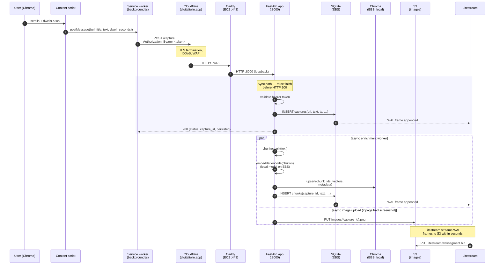

# Flow — Capture path

How a page read in Chrome becomes a row in SQLite + a vector in Chroma.

Triggered when the user dwells ≥30s on a page; the content script posts
to `/capture`, the backend stores text + metadata, and an enrichment
worker chunks + embeds asynchronously.

## Failure-mode notes

- **Token rejected** — API returns 401 immediately; the content script
  drops the capture and surfaces a one-time toast. See
  `flow-failure-modes.md`.
- **Embedder OOM on large pages** — enrichment retries with a smaller
  chunk size; the SQL row is already persisted so retrieval still finds
  it by FTS5 even before vectors land.
- **S3 PUT fails** — image upload is best-effort; capture is not rolled
  back, image just isn't recoverable on later restore.
- **Litestream lag** — captures land in SQLite first, replication is
  async. RPO is "seconds, not zero". Acceptable for v1 single-user.
