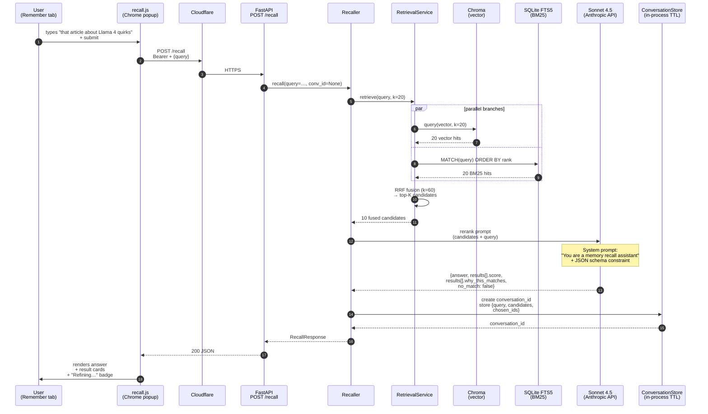

# Flow — Recall path (happy path, first turn)

How a vague query ("that article about Llama 4 quirks") becomes a
ranked list of capture cards.

This is the path implemented in Phase 4 M.2–M.4. Two retrieval branches
run in parallel, results are fused via RRF, then a Sonnet pass reranks
the top-K with reasoning, and the response carries an answer + cards
back to the popup.

## Fork: no-match path

If Sonnet returns `no_match=true`, the closest-miss prompt is invoked
(separate Sonnet call) to surface ONE courtesy card with low confidence.
The popup shows the "Not confident this is it…" banner.

## Latency budget

| Step | Target | Hard cap |
|------|--------|----------|
| RetrievalService (parallel + fuse) | <200ms | 500ms |
| Sonnet rerank | <3s | 10s |
| Total /recall p95 | <3.5s | 12s (popup timeout: 30s) |
