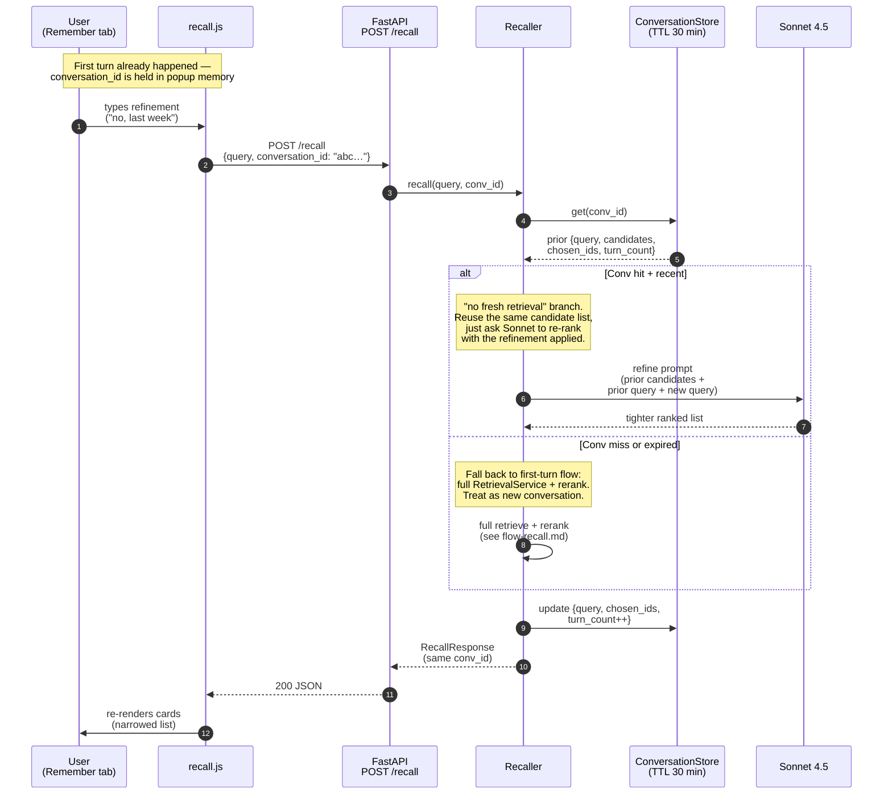

# Flow — Recall refinement turn (U.3)

Second and later turns within a conversation. The user types a
clarification like "no, the one from last week" and we want to reuse
the candidate set from the first turn instead of re-retrieving from
scratch — that's the "no fresh retrieval" branch.

## Why "no fresh retrieval" is safer than re-running everything

- The candidate set was already curated by RRF + Sonnet on turn 1.
  Re-retrieving with a refinement like "last week" would skew the
  ranker toward temporal recency at the cost of topic match.
- Cheaper: skips Chroma + FTS5 calls entirely on refinement turns.
- Predictable: the user expects the list to narrow, not change topic.

## Conversation lifetime

- In-process dict, TTL 30 min, no DB persistence.
- Popup close → conversation_id forgotten on the client side; the
  backend entry expires on TTL.
- "Start over" button on the popup nukes `conversationId` and treats
  the next query as turn 1.
